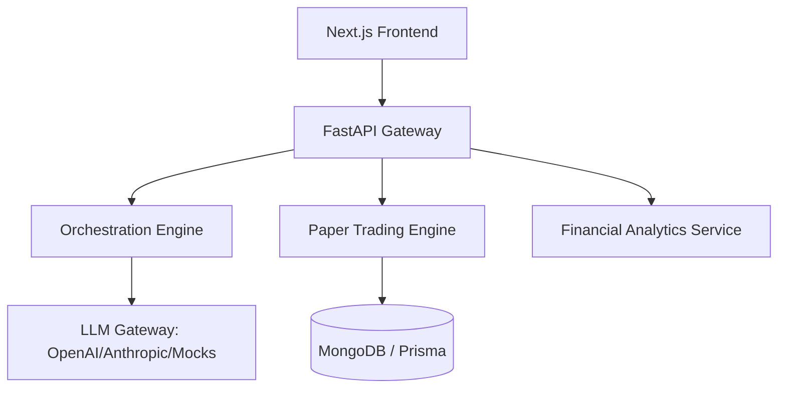

# Arquitectura del Sistema

El proyecto **Fintech AI Agent Orchestrator** sigue una arquitectura de microservicios desacoplados para garantizar escalabilidad y mantenibilidad.

## Diagrama de Arquitectura

## Componentes Principales

1.  **Frontend (Next.js 14):** Gestiona la UI profesional, los gráficos financieros y el estado de la orquestación.
2.  **FastAPI Backend:** Actúa como el orquestador central y motor de ejecución.
3.  **LLM Gateway:** Implementa un patrón *Strategy* para alternar entre modelos de IA reales y simulados.
4.  **Paper Trading Engine:** Procesa la lógica financiera de órdenes y balances sin riesgo real.

## Modelo de Datos

- **Agent:** Define el comportamiento y límites de la IA.
- **Trade:** Almacena el historial de operaciones y P&L.
- **Portfolio:** Agrega el estado financiero global del usuario.
